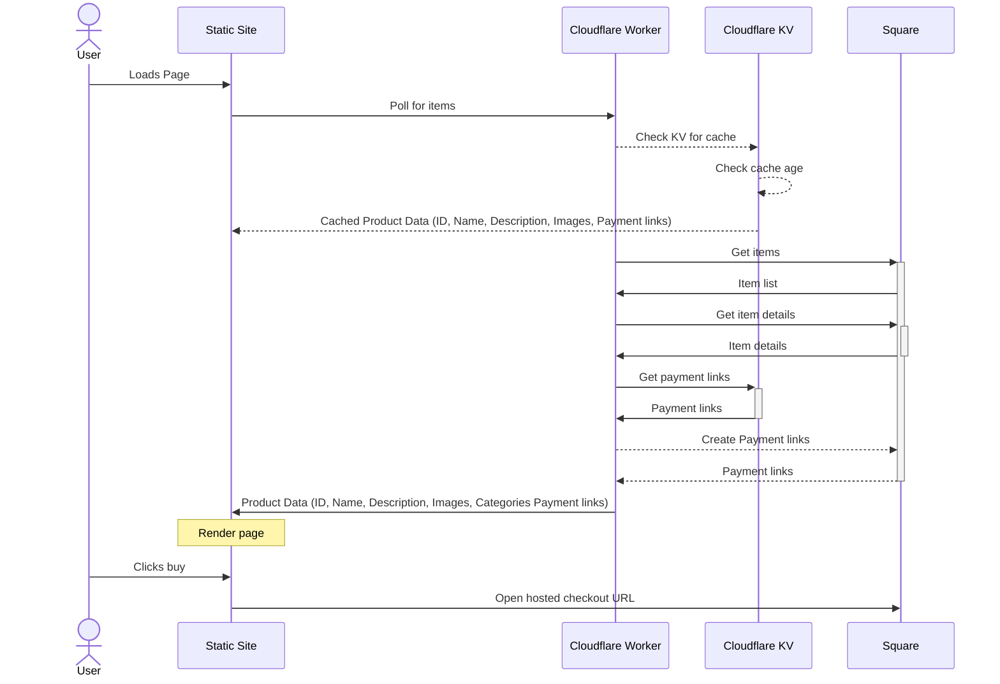

## **Woodturning And Web Development**

I accidently picked up a new hobby after my partner gifted my dad an I a wood turning course/experience thing for Christmas 2023. After talking to a colleague about it, it turned out she had a lathe in her garage that was going unused; after borrowing that for a bit it's quickly taken over my spare time (and most of my house). With wooden bowls, pens, and all sorts of other creations piling up, I need a way to offload these one of a kind, priceless artefacts to recoup the costs of wood, oil, and sandpaper.

[You can help by buying them](https://shop.vaines.org/)

Rather than cluttering up Etsy, who charge a relitively large commissions and seems to have become a haven for drop-shipping sellers, I decided to roll my own ecommerce solution. It had to be cheap (read free), simple, and effective. That's how I ended up building a small ecommerce website using Hugo, a static site generator, Cloudflare Workers, and Square for payments. Here’s how I did it and some of the lessons I learned along the way.

***

## **Why Hugo and Square?**

I first came across a blog post about using [Hugo and SnipCart](https://snipcart.com/blog/hugo-tutorial-static-site) to set up a simple e-commerce site. While it was a great starting point, SnipCart charges a static $20 a month for the smallest usage. Given my expected sales volume (a handful of one-off items), paying a subscription for an infrequent hobby shop didn’t make sense.

Enter Square. We've already joked about selling my wares at local fairs and church fates and with Squareyou can accept contactless payments painlessly, so integrating it with an online store felt like a natural fit. Square handles payments, including all the compliance headaches around payment information, so I don’t have to worry about it. And best of all? Square only charges a transaction fee, no monthly overheads—perfect for my low-volume shop.

### **Static Hugo Site + Cloudflare Worker for dynamic content processing**

I'm a big fan of static site generators but love the Hugo in particular, in fact, this blog is built using it. Static site generators are incredibly fast, secure, and require almost zero maintenance. I find Hugo in particularly is also super easy to build with, which is a plus when you’re not looking to spend too long on the website and focus on the content/products instead.

Square and Hugo don’t naturally integrate though, which is where a bit of creativity came in. I used a **Cloudflare Worker** as an intermediary. The worker fetches product data; like descriptions, images, and prices from the Square API and transforms it into a JSON feed, which Hugo can consume and display as part of its rendered content.

I implemented caching for the worker using **Cloudflare KV storage** to reduce the number of API requests to Square. This way, I avoid being throttled by Square’s API (or worse, charged!). The caching layer stores product details and payment links so that the worker doesn't need to call Square on every page load with a configurable cache expiry age. The workflow looks something like this:

The repository for the website and the [code can be found here](https://github.com/avaines/shop.vaines.org)

### **Challenges and Learning: Working with Square’s API**

Integrating Square’s API was a bit of a learning curve, especially since JavaScript isn’t my strongest suit. Whilst CloudFlare Workers support JS, TS, Python, or Rust this seemed like a good opportunity to learn something new, with Advent Of Code being just around the corner, it seemed like a good excuse to practice and improve my JavaScript skills.

One tricky part of using Square was the way the API handles payment links. When you create a catalog item in Square, there’s a handy button to generate a payment link, great. However, this link isn’t retrievable via the API (confirmed by support), which caused a bit of head-scratching. Originally, I considered storing the link as a custom attribute in the product catalog, but that felt too messy. Instead, I ended up caching the links in the Cloudflare KV once they created then checking there first and generating one if not. Since relating a created payment link back to a specific product seems pretty difficult this worked out great.

*I did have a worry that one a payment link is used it would no longer be valid but since my products are one-offs, I don't really care and didn't investigate this in any way. If you're reading this and do plan on selling several of the same item, check this works properly as you might need to explore a different approach.*

### **DIY Ecommerce with Modern Tools**

Building an e-commerce site doesn’t have to be complicated or come with a large maintenance overheads like managing servers and big bags of shit like Wordpress, Drupal, or Joomla. Neither does it have to cost you a monthly fee ... if you are willing to make some sacrifices and put a bit of the work in yourself. I do appreciate not everyone is likely to be able to plumb this sort of thing together in a weekend and the minimal fee for things like SnipCart, Squarespace and even the free online store that comes with Square (Ad supported) are the price for the convenience.

Using Hugo, Cloudflare Workers, and Square, I’ve created a simple, effective, and low-cost way to sell my one off wood-turned creations online. It’s been a fun technical challenge that’s not only improved my skills but also allowed me to explore more shiny Serverless toys - *I do love Cloudflare, so much so that I have a talk on why its the best cloud provider*

If you've found this post through looking to setup something similar, rather than me shilling it around the place; give it a go, it’s surprisingly straightforward and scales easily with minimal costs. All the [code can be found here](https://github.com/avaines/shop.vaines.org).
