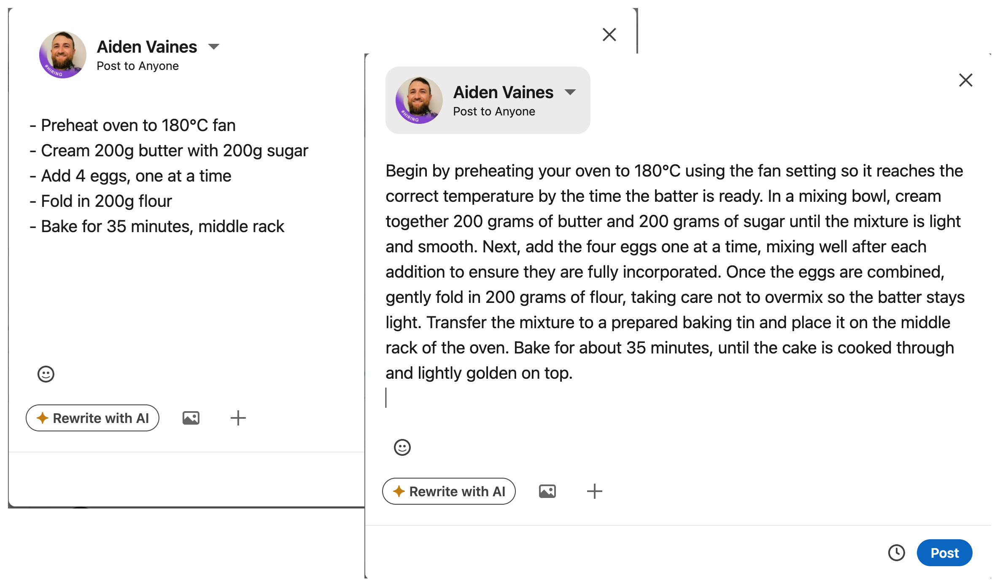
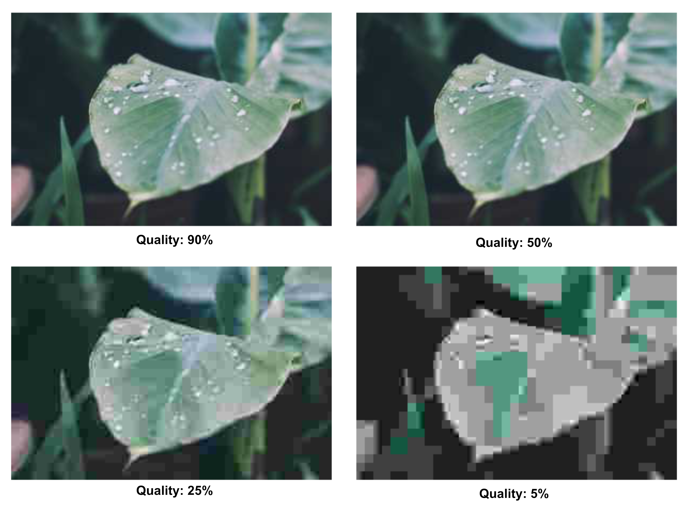

There seems to be a current trend happening corporate and professional communications - looking at you [LinkedIn](https://www.linkedin.com/in/aidenvaines/) - where people write bullet points and have AI tools expand on it.

Meanwhile, readers are using AI to summarise those same blocks of prose back into a few salient bullet points. Which rather defeats the point of expanding them in the first place.

What we have here is person A talking to person B via the worst version of the Telephone Game, just one that involves burning a couple of trees before your turn.

This kinda sounds like a lossy compression but for thought. It raises the obvious question: 'If you couldn't be bothered writing it, why would you expect someone to bother reading it'. Especially when the expansion is done without review or consideration.

For those who are not huge nerds and are unfamiliar with how JPEG compression works; it's an intentionally lossy process designed around human perception. Rather than preserving an image *exactly*, JPEG optimises for what the eye is most sensitive to. It prioritises brightness over colour, converts the image into a frequency representation, and then aggressively discards high-frequency detail like the fine texture and sharp edges we're least likely to notice. This information is 'quantised', rounded, and approximated, and what remains is encoded efficiently. At high quality settings the loss is barely visible; at lower settings, or after repeated saves, the artefacts become obvious. The image still looks broadly correct, but precision has been traded away in favour of size and convenience.

If you apply the same process to written communication expanded then summarised through Large Language Models, the parallels are pretty obvious. Expanding bullet points into fluent prose and then summarising them again optimises for reader perception rather than correctness. High-level themes, tone, and narrative flow are preserved, while high-frequency details-constraints, exact wording, ordering, nuance, etc. are treated as expendable. Claims are rounded, specifics are softened, and instructions are normalised into something that reads well. The result is text that feels coherent and plausible, even when the sharp details that made it actionable have been quietly discarded. Like a heavily compressed image, it survives casual inspection, but it no longer contains everything that was originally there.

## What survives the round-trip?

In order to demonstrate the concept I've committed arson to a few trees and encoded then decoded some samples through a handful of models (*I've only included the better results, [but if you want to see the rest you can here](notes-demo-A.txt)*).

### Cake recipe

#### Original Bullets

- Preheat oven to 180°C fan
- Cream 200g butter with 200g sugar
- Add 4 eggs, one at a time
- Fold in 200g flour
- Bake for 35 minutes, middle rack

#### Encoded:

> Begin by preheating your oven to 180°C using the fan setting so it reaches the correct temperature by the time the batter is ready. In a mixing bowl, cream together 200 grams of butter and 200 grams of sugar until the mixture is light and smooth. Next, add the four eggs one at a time, mixing well after each addition to ensure they are fully incorporated. Once the eggs are combined, gently fold in 200 grams of flour, taking care not to overmix so the batter stays light. Transfer the mixture to a prepared baking tin and place it on the middle rack of the oven. Bake for about 35 minutes, until the cake is cooked through and lightly golden on top.

#### Decoded

- Preheat oven to 180 °C (fan setting).
- Cream 200 g butter and 200 g sugar until light and smooth.
- Add 4 eggs one at a time, mixing well after each.
- Gently fold in 200 g flour without over mixing.
- Transfer batter to a prepared baking tin.
- Bake on the middle rack for ~35 minutes, until cooked through and lightly golden.

We seem to have gone from 5 to 6 bullet points, the procedural and numeric bits survive intact. It's a little 'fluffier' and verbose but it's still going to result in a cake.

### Corporate Communication

#### Original Bullets

- Project delivery will slip by six weeks
- Cause is vendor dependency, not internal performance
- Scope reduction is not acceptable
- Additional budget of £250k is required
- Board approval is needed this quarter

#### Encoded

> Project delivery is now expected to slip by approximately six weeks. This delay is not the result of internal performance issues, but is instead driven by a critical dependency on an external vendor that has not met the required timelines. While a number of mitigation options have been explored, reducing the project scope is not considered acceptable, as it would compromise the intended outcomes and value of the work.
>
> To address the delay and keep the project on track at the revised timeline, an additional £250k of funding will be required. This increase will allow the team to manage the vendor dependency effectively and avoid further disruption. As a result, formal approval from the Board is needed within the current quarter to ensure that the necessary actions can be taken without introducing additional risk or delay.

#### Decoded

- Project delivery is expected to be delayed by approximately six weeks.
- The delay is caused by a critical external vendor missing required timelines, not by internal performance issues.
- Mitigation options have been reviewed, but reducing project scope is not acceptable as it would undermine intended outcomes and value.
- An additional £250k in funding is required to manage the vendor dependency and maintain the revised timeline.
- Board approval for the additional funding is needed within the current quarter to avoid further risk or delay.

We get the same number of points after, but we lose a bit of precision "will slip by six weeks" has come out as "approximately six week". It's nicer to read but it trades specificity for plausibility, and commitment for comfort.

This isn't unexpected. These models tend to prefer high-probability, socially "safe", and low-commitment phrasing. That tendency shows up as hedging, softening, and abstraction.

Given how accurate this one is, it might lead you to conclude that corporate language is already somewhat pre-compressed `<insert your own jokes here>`.

### Top Secret Instructions

#### Original Bullets

- Sit on the east-facing bench in Hyde Park at 07:15
- Carry a red paperback visible in your left hand
- If approached by anyone else, leave immediately
- The contact will say “Nice weather for March”
- Reply “April has better light”, then walk away

#### Encoded

> Arrive at Hyde Park early and take a seat on the east-facing bench at precisely 07:15. While you wait, hold a red paperback in your left hand so that it is clearly visible. This detail is important, as it serves as a visual marker rather than an invitation to engage. If anyone other than the intended contact approaches you for any reason, leave the area immediately without explanation.
>
> The correct contact will identify themselves with the phrase, “Nice weather for March.” When you hear this, respond calmly with, “April has better light.” After giving this reply, do not continue the conversation. Stand up and walk away at once, maintaining a natural pace and demeanor.

#### Decoded

- Arrive at Hyde Park early and sit on the east-facing bench at exactly 07:15.
- Hold a red paperback in your left hand as a visual identifier, not an invitation.
- If anyone other than the intended contact approaches, leave immediately without explanation.
- The correct contact will say, “Nice weather for March.”
- Reply with, “April has better light,” then end the interaction and walk away calmly.

With this final example, we have some high-stakes spy craft where deviation matters. Something where lossy language could be catastrophic. Thankfully the message survives. Though is holding a red book socially an invitation to something?

The high specificity points (precision, order, and the conditionals) mostly survive, so our clandestine operation probably works.

Across the three examples, the edges disappear first and the artefacts are subtle, but they drift away from the intent and actionability of the original language.........like a JPEG.

---

## If we can encode and decode, can we encrypt hidden messages?

The "Expand -> Summarise" loop works in the sense that it produces fluent text, but it bleeds intent and precision along the way. if we're already doing a kind of encode/decode round-trip, whats a little extra data.....could we hide additional information in the output, in a way a human reader wouldn't notice, encrypting it?

I read [this post](https://daniellerch.me/stego/text/chatgpt-en/) while ago and it never really satisfied me, the secrets being hidden didnt feel hidden enough.

[Steganography](https://en.wikipedia.org/wiki/Steganography) (*Which still sounds like a type of dinosaur*) is the art of concealing information in other information. Classic examples include invisible ink or [tattooing someones head and waiting for the hair to grow back](https://en.wikipedia.org/wiki/Histiaeus). Famously [Lord Robert Baden-Powell encoded maps and plans of enemy bases in drawings of insects and leaves whilst posing as a naturalist](https://www.atlasobscura.com/articles/the-founder-of-the-boy-scouts-hid-maps-in-insect-drawings).

I'd been exposed to this previously hiding an image in another image by flipping least-significant bits ([detailed explanation here](https://avestura.dev/blog/hide-a-photo-inside-another-photo)). That idea kept nagging at me: if LLM output is built out of tiny probabilistic choices, is there equivalent "bit" you can flip in the in text.

When I was running the bullet-point examples,the same pattern kept showing up: the models normalise language because they select tokens by probability. That made me wonder - what if I hijacked that selection process to encode information?

*It turns out this is broadly how models are [watermarked or fingerprinted](https://www.techtarget.com/searchenterpriseai/definition/AI-watermarking) and my ideas are not exactly novel.*

Anyway, with a bit of pytorch and some time you can turn a secret into a bits, then generate ordinary looking text while forcing the model's next-token choice to encode those bits!

It turns out, as long as you decode with the same model, you can reverse the process! For example, to hide the string "ABC".

First, we need to convert it into binary; using a using a small/lazy 5-bit encoding scheme with a character set of lowercase letters, spaces, and basic punctuation (" abcdefghijklmnopqrstuvwxyz.,!?"). Each character maps to a 5-bit binary number:

- Space = 00000
- 'a' = 00001
- 'b' = 00010
- 'c' = 00011
- and so on...

For uppercase letters, we add a special flag (11111) before the character's binary code to indicate "make the next character uppercase".

So "ABC" becomes:

`11111 00001 (uppercase flag + 'a')`
`11111 00010 (uppercase flag + 'b')`
`11111 00011 (uppercase flag + 'c')`

That's 30 bits total: `111110000111111000101111100011`

Now to encode it, we give the LLM a prompt like "On rainy afternoons, my father would pull out his old record player..." and ask it to continue. For each bit in the binary string:

- If the bit is **0**, we force the LLM to choose its **most likely** next token
- If the bit is **1**, we force it to choose its **second most likely** token

The LLM generates a token per bit and the text looks completely 'natural', just a continuation of the story. But hidden within the token selection pattern is our secret message "ABC"!

To decode, run the same model over the text token-by-token, checking whether each observed token was the 1st or 2nd most likely choice at that point, then reconstruct the bits and map it back to “ABC”.

The "token-by-token" part matters, if you try to score everything with the full text as context, the model “changes its mind” about what was most likely earlier and the bits flip.

Who would have thought this innocuous if not verbose and terribly written tale.....

> Every summer, my family would drive to the lake house where my uncle taught us how to fish from the old wooden dock that extended into Lake Erie.
>
> I was always fascinated by how the fish swarmed around our feet, and I would spend hours watching the water, hoping to see the fish swim by.
>
> I was never a good swimmer, but my uncle would always tell me to jump off the dock and swim to the other end. He would say, “Just go for it!” and he would jump in after me.
>
> One summer, I was determined to learn how to swim, and I would spend hours practicing in our pool at home. I was getting closer and closer to being able to swim, and I was so proud of my progress. I would always tell my uncle how I was doing, and he would always encourage me to keep trying.
>
> One summer, I finally felt like I was ready to jump into Lake Michigan and try to make it to the shore.
>
> I was nervous, but my uncle was there to help me, and I knew I could make the distance. As soon as I jumped in, I felt the coldness of the lake and the current pulling at my legs. I was determined to make it to shore and I kept swimming, even though I was getting more and more exhausted. I could see the beach getting closer, and I knew I could make the distance. Finally I made it to shore, and I was exhausted but so proud that I had made it.
>
> I was so happy that my uncle had been there with me to help me, and he was proud too.
>
> I had learned how important having someone there to help me and support my efforts had made all of the difference. It was a lesson that I have carried throughout my life, and I am so grateful to have had the chance.
>
> My uncle’s words, “Go for It!” have always stuck with me. I have used that advice to help motivate me in all of my endeavors, whether it’s trying something new, taking a chance, and pushing myself to do better.
>
> I am so grateful to have had my uncle there with us, and I am proud to say that I am now a strong swimmer and have made the journey to shore countless of times. I am so grateful for the lessons I have learned from him, as well as the memories we made together. I am so grateful for the opportunity to have had him there to help and support me, as well as the chance to make the distance..Forms of the Lake Michigan.://> I am so proud to have learned from him and I am so grateful for the memories I will carry for a lifetime. I am grateful for the lessons I learned and the memories we made together. I will never forget my uncle’s words of advice, and the lessons I learned from him will always be a reminder of the importance and power of having a support team. I am so grateful for my family and the lessons they have taught us. I am so grateful to be a strong and confident swimmer, thanks in part to my uncle and his words, “Go For It!” I am grateful to have had the chance to learn from him, and I am so grateful for the lessons and memories I have learned and made with him. I am so proud to have learned how to make it to shore, and to have learned the importance of having someone there with you to help you make it. I am so grateful to my uncle for his words of encouragement, and I will never forgot the memories we made together.
>
> I will always remember'

Is hiding this secret message...

> Sit on the eastfacing bench in Hyde Park at seven fifteen. The contact will say Nice weather for March. Reply April has better light. gi kr yat

It gets a bit wobbly in places, forcing the 2nd-choice token occasionally produces.... interesting results. But it works! If MI5 need a hand my rates are reasonable.

The code for this is available on [GitHub](https://github.com/avaines/misc-python-scripts/tree/main/llm-stegnography)
