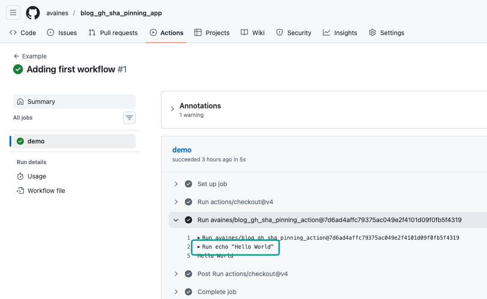
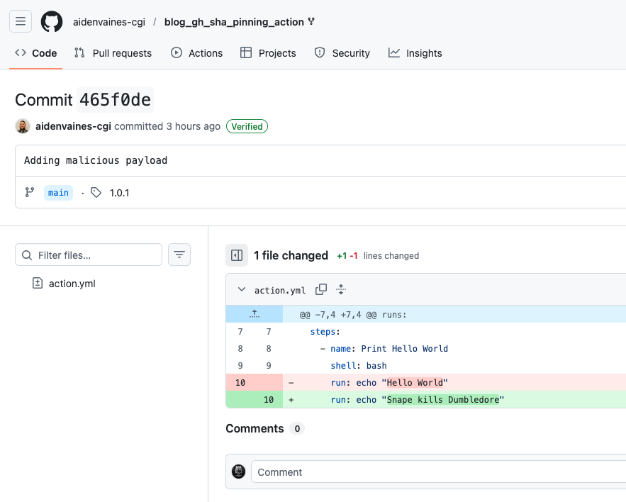
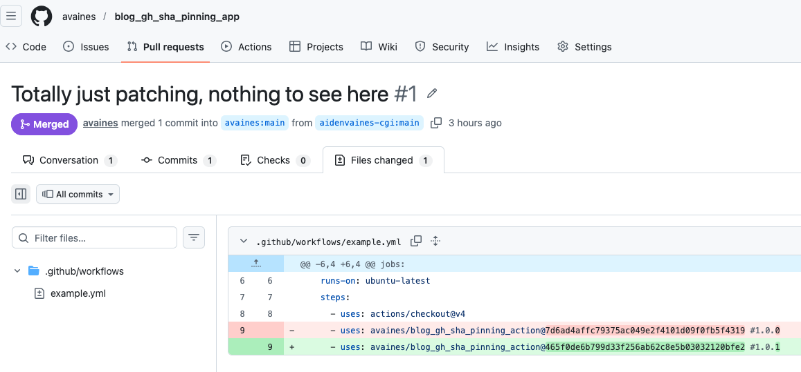
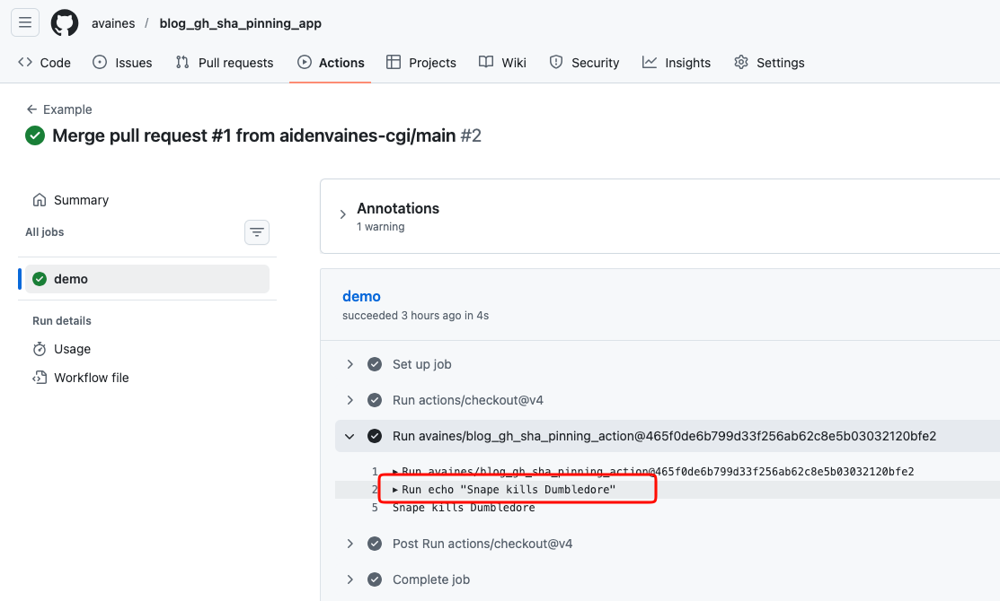
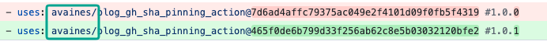

In March 2026, Trivy became the latest reminder that software supply chains are, at best, loosely held together with convention and trust.

A typosquatting attack slipped malicious code into what looked like a legitimate dependency path. The post-mortems are worth reading, and they all converge on a single recommendation: *pin your dependencies*. In the GitHub Actions world, that usually translates to *use commit SHAs, not tags*.

There’s a widely held belief that pinning a GitHub Action to a commit SHA gives you immutability, its what Microsoft/GitHub are recommending, and its what Aqua are recommending. After all, a SHA is content-addressed. It cannot be moved. It cannot be re-tagged. It is, in theory, the most stable reference you can use. The problem with that line of thinking is that the *resolution of that SHA is not scoped the way most people assume*. Specifically, GitHub Actions **does not** meaningfully validate that the commit SHA you reference belongs to the repository you think it does.

## Wait, what? No, thats not right...

I set up a deliberately small example to test this behaviour.

* A “legitimate” action: `avaines/blog_gh_sha_pinning_action`
* A consuming application: `avaines/blog_gh_sha_pinning_app`

The application references the action in the usual way:

```yaml
uses: avaines/blog_gh_sha_pinning_action@<some-sha>
```



So far, so normal.

Now introduce an attacker:

* Fork the action repository to `aidenvaines-cgi/blog_gh_sha_pinning_action`
* Add a malicious step (*in my case, just printing output, but in reality this is where you exfiltrate all the fun stuff like secrets and personal data*)



Next, create a pull request to the consuming application that *appears* to simply bump the pinned SHA:



The SHA used in the PR comes from the attacker-controlled fork of the action, despite it still being referenced as `avaines/blog_gh_sha_pinning_action`

You might reasonably assume one of the following safeguards exists:

* GitHub validates that the SHA belongs to `avaines/blog_gh_sha_pinning_action`
* Or the workflow fails because the commit cannot be found in the specified repository

**Neither is true, and that is madness**

The workflow executes successfully!!!!!!!



GitHub resolves the commit SHA, finds a matching object, and executes it, regardless of which fork it originated from.


From the platform’s perspective, a fork is a separate repository with a shared object graph/history. When the runner resolves the reference, it ultimately looks up the commit in the Git object database; if that object exists and is reachable, it can be used regardless of which fork introduced it. A commit object is globally identifiable. If the SHA exists anywhere reachable, that is apparently sufficient.

The result is that a pull request can replace a pinned, trusted action with attacker-controlled code without changing the apparent repository reference.

If the reviewer is scanning for obvious changes like owner, repo name, or tag they will see none.

Only the SHA changes and with that comes a huge amount of assumed trust. I know that owner, and I know that repository, its just a version bump, and a minor one at that, with that comment next to the tag doing a lot of heavy lifting. We’ve just spent the last few years training people to treat that as *best practice*.



A lot of the current guidance focuses on avoiding tags because they are mutable, which is true: tags can be moved, and relying on them introduces an entirely different risk. Github already has a 'Make tags immutable' feature, but it's optional, therefore, neither used nor can it be trusted as the owner (or attacker) could just disable it.

Simply switching to SHA pinning does not eliminate the problem, in some respects it makes it worse. Tags **are** scoped to  `owner/repository` because thats how they work. You could argue its harder to compromise that repository rather than hijack it through a forked repository and then writing actual changes to the repository. Whereas a commit object is content-addressed and can be reachable from multiple repositories that share history (e.g. forks)

I believe the industry advice is a bit of an overcorrection, and we’ve replaced one weak guarantee (mutable tags but scoped to repo) with another vastly worse idea in unscoped SHAs. Yes you should check, yes you should validate it, but tags are human readable, SHAs are not and if you ask yourself "Do I always properly check?" do you? because I can't say I do enough validation 100% of the time.

## Supply Chain Woes

The Trivy incident is not interesting because of the tool. Though it is the thing that's caused me a lot of bother over the last month, and its symptomatic of the constant supply chain threats we're seeing everywhere. Late last year NPM was basically a skip fire ([https://www.wiz.io/blog/widespread-npm-supply-chain-attack-breaking-down-impact-scope-across-debug-chalk](https://www.wiz.io/blog/widespread-npm-supply-chain-attack-breaking-down-impact-scope-across-debug-chalk), [https://www.wiz.io/blog/shai-hulud-npm-supply-chain-attack](https://www.wiz.io/blog/shai-hulud-npm-supply-chain-attack), etc). We've delegated so much behaviour to 3rd parties we can't, and shouldn't implicitly trust. The [https://www.npmjs.com/package/is-odd](https://www.npmjs.com/package/is-odd "https://www.npmjs.com/package/is-odd") package became a bit of a meme for this exact problem, where tool chains like NPM and GitHub Actions place re-usable custom modules/actions/libraries as an attractive off the shelf solution to solve common problems so you don't have to.

Ironically with the rise of AI, it's now easier to just vibe code the same functionality yourself that use one of these off the shelf resources, and you can still know exactly as much about how security, your data, and to some extent the functionality works with strangely more ownership and a smaller attack service.

GitHub Actions, in particular exacerbates this somewhat as workflows routinely execute third-party code, the secrets are implicitly available to those workflows and there are multiple ways to extract those at runtime with little audit or oversight. Then to top it all off SHAs are not human friendly and tags are not immutable so review processes tend to focus on *what changed*, not *where it came from. Which is all a fragile house of cards, sometimes I miss Jenkins.

## If “use SHAs” is not sufficient, what is?

At a minimum, we need to introduce *provenance checks*. I've said above that SHA's are not human friendly like tags so theres a couple of things we can, and probably should be doing to validate. Obviously that the SHA or tag exists in the right repository and GitHub should enforce tag mutability in my opinion:

We tend to describe these incidents as “supply chain attacks”, which is accurate but slightly misleading. It implies a complex and sophisticated multi-stage compromise by 1337 h4x0rz. In reality, the weakest link is often much simpler because humans are a bit shit sometimes. SHA pinning being touted as the solution is just security-theater rather than due diligence in an ecosystem that is not helping either.
