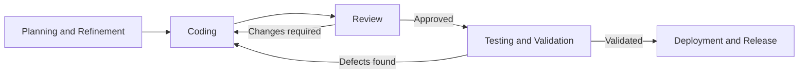
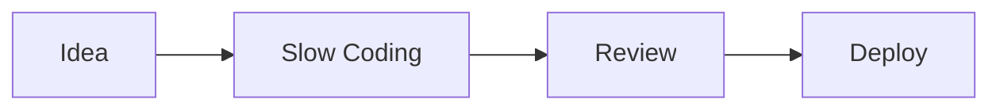
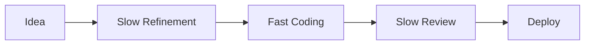
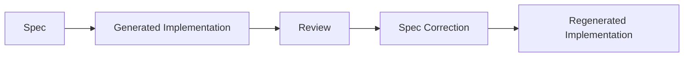

I'm often asked about AI stuff as the rest of my blog might suggest. The world is currently scrambling around for how and where AI best accelerates delivery of software programmes, but I still don't think there is one solution - similar to what happens when you ask any two people how JIRA should be used to be fair.

There's so much hype and a lot of vapour-thought for ways of working that sound legit but have never been battle tested at any scale. Intermixed with that are some amazing success stories and methodologies that work great for a a particular org or project or just a single team greatly enhancing their workflows.

A team I'm working with have been delivering code - *yes, into production* - for a little while and I'm seeing a pattern emerging from elsewhere in my programmes alongside those my peers work on doing similar AI acceleration journeys.

Engineers are reporting they are shipping code faster, the tools are being used regularly and they are mostly liked. Qualitative measures like [SPACE](https://getdx.com/blog/space-metrics/) show things improving and moving quickly but the quantitative measures like DORA, the entrenched way to measure how things are moving...haven't moved. In some cases they've reportedly got worse.

| DORA Metric| Change |
| --- | --- |
| Deployment Frequency | ➖ |
| Lead Time For Change | ➖ |
| Time to Restore Service | ➖ |
| Change Failure | 🔻 |

On the surface this is an uncomfortable place to be. AI is the second coming of Jesus if you believe the hype, so why doesn't it *make numbers go up*? Engineers reckon they’re faster and stuff is going out faster for the most part - [yes I know all about the '19% study slower'](https://arxiv.org/abs/2507.09089) - but all the measures we use, rely on, report on, and optimise for haven't changed positively or resoundingly.

## DORA cares not for your AI tools

DORA doesn’t care how quickly code appears on a screen. It cares how reliably and smoothly changes make it to production. Roughly that should include:

When you use AI automation like SpecKit, BMAD, or similar tooling, you take away some of the human bashing at the keyboard or poking and prodding at a handful of Claude/Copilot/Codex (why are they all C nouns?) terminals. The focus heavily switches from writing code to writing specifications, capturing and refining requirements and validating decisions. On the other side of the code generation task it's reviewing, criticising, and mobbing on a PR.

It's not unreasonable to say that AI generates more fluff than most meat-developers do and it does take longer to properly go through, trim, redirect and refactor AI output. Even if the AI is doing the heavy lifting, and it does it faster than us mere mortals can, it needs iterating, checking and validating just like if humans wrote the code. There are decisions and choices in how it's built things, weird variable name choices, there's 300 tests which all pass.....because they are doing the equivalent `Assert True` . Ultimately you're responsible for the code you commit, even if you effectively outsourced it to a robot.

AI applies pressure at a single stage; code generation. There's now more work entering the system, our review capacity, CI/CD throughput, release governance, and risk tolerances largely all stay where they are. But the system is processing work at roughly the same rate, we're just tackling things larger than the old limits imposed by the bottleneck of us lazy humans limited by sleep, caffeine, and roughly 10 fingers.

Sizing of work becomes a bit of a weird space too. Before you start measuring your deployments, how do you estimate a piece of work? Yes, you know roughly how you might tackle it, maybe you've got a rough plan in your head of where in the codebase it touches, how you might test it and so on. But you're not hands-on writing the code, you'll be drawing up specifications and requirements. Code generation is being handed off to an LLM to generate the code. You want to assume like you would with you human peers, it's having a good day and doesn't fall down rabbit holes, but the reviews and subsequent re-generations still take time.

If you imagine any old 3-point story that includes an amount of writing some code but apply a SpecKit style AI workflow to it, the code is going to be almost entirely AI generated. You're likely to end up with more code to review, more edge cases through AI non-determinism. You then need to take the time you may have spent writing the code writing an implicit scope or contract spec to hand to the AI.

> On the determinism statement; I've heard this as a detractor statement for AI code generation quite a bit. I think if you asked any two developers, or the same developer a month apart, to write the same thing from the same information you would get two different results anyway as humans aren't deterministic either. I usually describe AI as being a cupboard of junior engineers. You chuck solid requirements in, you should get something working out but if you put crap in you get crap out. AI is the same, just each conversation (session) is a new engineer.

Once you've handed the specs for your theoretical 3-pointer over to the magic box of [goblins](https://openai.com/index/where-the-goblins-came-from/) and performed your favourite ritual of computation; slaughter a couple of goats, scroll through [hackernews](https://news.ycombinator.com/), whatever. Then you look at what the magic box has produced and hope it's good or at least close. DORA assumes relatively stable units of work but the assumption starts to wobble a bit when you hit review phase and the code produced is poor quality, missed the target or perhaps is totally broken and you need to stretch the metaphor and kick the box of goblins a bit.

You can now either re-run the code generation phase, hope Jupiter is in retrograde, and hope the result is closer to the expectation. If where AI went wrong is clear, you may be able to revisit the Spec and correct the problem before re-generating. If the code was close enough you might be able to steer it back into line or over the final hurdle. Whichever path gets taken is something we now need to measure. The measures for DORA might cover some of these activities but it's not going to surface the time back and forth and the struggle or pain points with the process. If the metrics are not providing feedback for improvement, what's the point?

### What are we actually measuring?

I started trying to think over what I'm actually using my metrics for, how they inform decisions, and where it made most sense to recalibrate given the changes in the approach. I think the question I'm trying to answer is 'what makes sense to track to get the same signals?' given the shift of effort left and right towards planning and review, away from the classic development task.

Before AI driven development workflows (excluding review fix feedback loops) I imagined it looked, in its extreme like this:

With AI driven development, we push the effort left and right away from the code generation task.

The overall amount of 'stuff' getting done hasn't really changed anywhere, just where it's being done, and how it's carved up has changed. The bottlenecks on how much can be done in a single unit of effort/work are quite different too. We're still reporting and recording DORA metrics I just needs to measure different tasks and activities underneath them.

AI driven development task has lead us to, generally, larger, denser changes. It's easier to identify and scope tasks which previously you'd have carved up in to smaller tasks because, well....it's not you doing it.

I find I tend to think in units of 'delivered features' rather than what makes sense to develop specifically like I would in a more traditional capacity. Not because I'm not doing the work as I jest, but because it's moving from thinking in a 'doing' mindset in to more 'product' focus. For years as engineering types, we've felt like product and delivery people don't always understand why something can't be split into multiple tasks or divided in a certain way and .... oh no... I owe some people some apologies.

This trend towards larger units of work has a knock-on effect of bigger review effort, higher cognitive load for reviewers, and potentially a bigger failure surface. I thought the system/workflow might absorb the gains as additional scrutiny rather than expressing it as higher throughput. Which to some extent it has.

When we're reviewing this work, the team are mobbing on the review tasks - *we used to call this pair-programming in the olden days*. That's leading to our less senior team members better understanding what's going on, though I don't think this is as useful for learning as making mistakes and solving problems yourself. It helps with quorum for decision making and generally everyone actually having a good understanding of the system and generated code context. It is too early to really know what any of the long term impact of any of that is going to be.

I [read a study a couple of weeks ago](https://arxiv.org/abs/2507.00788)  where 150 or so professional developers were asked to write new features for a Java app, or expand its existing feature set with and without AI. They found task completion time improved by 30-50% with no overall change in code maintainability. Though there does seem to be a new study like this every five-minutes and I'm never sure who actually funded them. Scepticism aside, that does seem interesting that the previous generation of similar studies finding worse code and worse results. Have models got better? Are we more accepting of slop? Are we getting better at steering AI for our goals?

### History doesn't repeat but it does have four legs and barks

Manufacturing ran into similar problems like this decades ago; I've never worked in Manufacturing but Gene Kim et.al promised me in [The Phoenix Project](https://amzn.to/3PsgsvE) that they did.

Speeding up one stage doesn’t improve overall throughput unless all the bottlenecks move too, otherwise you just move the bottleneck. I think for this simplified SDLC example problem there are two main competing parts;

1. **Cycle time:** aka how long a piece of work takes. [Martin Fowler has a better explanation that I would ever write](https://martinfowler.com/bliki/CycleTime.html)

2. **Throughput**: how much the system delivers or can be processed by the system.

The AI development workflows compress parts of cycle time though throughput continues with a slightly different set of constraints or bottlenecks imposed by the front-loading and backloading of effort to refinement and review phases.

DORA metrics are of course not the only way you can measure things in the traditional SDLC and general software development spaces. My favourites or at the very least the four I have some actual experience and exposure to are;

- **Cycle time variants,** basically measuring where time is spent, not just the total.

- **[SPACE](https://queue.acm.org/detail.cfm?id=3454124)** adds satisfaction, communication, and activity to broaden the view, is more focused on a qualitative, I often describe SPACE as a vibes based alternative to DORA's hard measurements.

- **[DevEx](https://queue.acm.org/detail.cfm?id=3595878)** focuses on feedback loops, cognitive load, and flow.It comes from the same people who wrote SPACE, and is more focused, as the name suggests, on the Developer Experience.

- **[DX Core 4](https://getdx.com/research/measuring-developer-productivity-with-the-dx-core-4/)** tries to reconcile measures into speed, effectiveness, quality, and business impact. This is the only one of the list which at least acknowledges AI as a factor in modern development

From a certain height with a bit of a squint they are all trying to surface out similar useful information, I think it can all boil down to asking "How long does it take to do stuff?" and "How hard is it to do it?", essentially identifying where lifecycle *friction* exists. AI seems to just be adding a different type of friction which needs a highlighting without listening to the AI-token-hocking vendors who are profit incentivised to sell more tokens rather than useful implementations.

### Which looks better ; 👓.....or 🕶️. 👓.......or 🕶️

In most projects, DORA is already being derived from the existing toolchain. Jira tracks state transitions, commits reference tickets, and CI/CD systems mark deployments. Lead time is often calculated as something like “In Progress → Deployed” or “In Progress → Closed” and that's cool, we should continue to do so but we'll need make sure our measures account for the changes in how work is fed into the system for AI based working patterns.

Instead of reducing everything to a single lead time number, we'll need to keep more of the intermediate signals and derive some additional ones from the same data. By that I means, if you already have:

- Jira issue transitions (e.g. In Progress, In Review, Done)

- Git commits linked via ticket IDs

- Pull request timestamps

- CI/CD deployment events

Given the existing data we can pull out these three extra measures which I think should give the extra information to make what we showing previously under the same DORA sauce.

#### 1. Review latency (from Git)

You’re likely already collecting PR data implicitly for current measures, just instead of counting merges, extract:

- `first_review_at - opened_at`

- `merged_at - opened_at`

This should give us the surface for how long work waits once it leaves “In Progress”, so what would previously have been 'developer effort' now being 'reviewer effort' and treating the review phase as the time or engineering friction point. This should feed in to the lead time for change metrics we're reporting.

#### 2. Change footprint (from Git + Jira linkage)

You’re already linking commits to tickets so measure aggregates per ticket for:

- Total files changed

- Total additions/deletions

- `Number of PRs / commits`

Now a “3-point story” has a measurable implementation footprint rather than just a planning estimate, I like to call this one the 'Slop-osity' measure. I'm going to add a 'Slop-o-meter' to my dashboard when nobody is watching. These should feed heavily into the Deployment Rework rate reporting.

#### 3. Flow distribution (from Jira)

If lead time today is measured as:

> In Progress → Closed

Then keep the breakdown instead of collapsing it into a single A-B keep the

- Time in “In Progress”

- Time in “In Review”

- Time in “Ready for Release” / waiting states

You’re already storing this in the issue history but previously you probably only needed the collapsed result. Depending on how your releases go this could feed into Deployment Frequency or Lead Time metrics.

#### 4. Spec/rework loop count (from Jira + Git)

This is the one I think maybe the most important one for AI driven delivery. If a task goes:

The loop is really useful information as it tells us whether the issue was poor requirements, poor model output, too much ambiguity, too large a change, or a workflow that encourages people to keep rolling the dice and burning ~rainforests~ tokens rather than narrowing the target.

This should be trackable by measuring:

- Number of PR update bursts after review

- Number of times a ticket moves backwards from review to active work - which I've never really thought to include, partially because Jira doesn't make it easy.

- Number of linked spec or prompt changes after implementation starts

## 🌟'We did it!'

Given how AI code generation seem to be materialising within enterprises with an AI strategy, where the strategy isn't just "Here's Claude, do more, k thx bye" and feeding all the money into the AI money hole. There's still need to accurately know how long something's going to take to deliver and how much it will cost. It needs to work, and it needs to be understood, documented, supported, and stable to various levels and degrees depending on what it is.

As we move away from each line of code being lovingly crafted like the Code Artisans of old to something where expertise and engineering is used to steer, guide, and assess AI code output. We still need to get our hands dirty with an increasingly smaller and smaller pile of business logic and niche bits of logic where a human is still better. I still see AI as being a major contributor to the 80/20 rule in this regard, where we offload large portions of the tasks and focus on the difficult bits, the review and oversight areas.

Measuring stuff is obviously important and until someone smarter than me comes up with a better solution, I'm sticking with DORA's concepts with some changes in how I'm measuring rather than what I'm measuring for.
