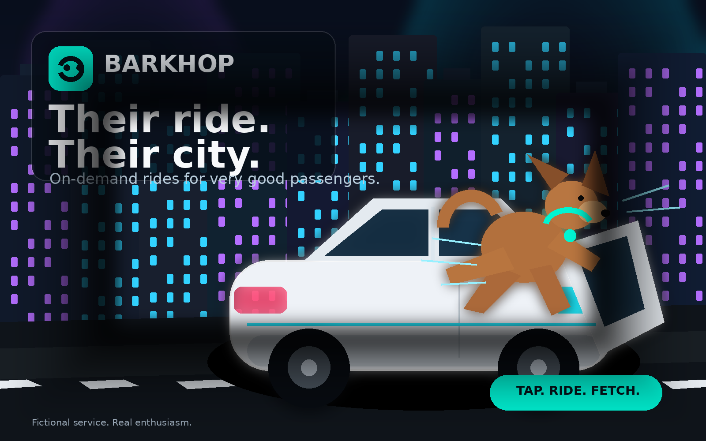

The other week I came across the concept of [Fuben-Eki](https://link.springer.com/chapter/10.1007/978-981-19-9588-0_1), which roughly translates as the “benefit of inconvenience”. Initially I thought it sounds like one of those ancient Japanese philosophies that has been tidied up for LinkedIn and eagerly scrolled down to the comments to see the '*Engagement*' but it is apparently a relatively recent system-design concept. Hiroshi Kawakami described it as looking for benefits that can only be gained through inconvenience: value that sits outside the usual axes of efficiency and functionality.

The basic idea seemed to be that making something easier does not necessarily make it better, which seemed poignant in the same week the creator of [Zig took a stabs at an Anthropic's AI port of Bun from Zig to Rust](https://raymyers.org/post/zig-creator-calls-spade-a-spade). Fuben-Eki suggests that sometimes the effort involved is responsible for part of the value. This got me thinking further about today's expanding layer of vibe slop across GitHub, and what happens when creating a substantial-looking software project no longer requires anyone to become particularly attached to it.

Most conversations about AI-assisted development are interested in removing blockers and in making code generation as accessible as possible. Code takes time to write, therefore generating it **more** quickly is obviously **more** better. This is mostly true, manually writing another API client has never built much character but theres something about that effort producing more than code.

## You Built This, Unfortunately

There is something about spending a blood, sweat and tears on a project that makes you care about it. Some of that is straightforward sunk cost fallacy, you've spent 6 months building the thing, so you continue despite all available evidence suggesting that the original idea was terrible, and you should feel bad for thinking it was good. Economists are correct that previous expenditure is not, by itself, a rational reason to keep spending, but humans gotta be human and continue despite those economists' wishes.

The time invested in a project also produces things that are not *sunk*. You learn the problem properly, you discover where the weird edge cases are at 3 in the morning, you understand why the database schema has that slightly odd table, which approach was tried before, and why changing an apparently harmless method causes invoices to be sent twice. In other words, you know where the bodies are buried because you buried 'em.

Software that has survived for a while tends to accumulate this sort of knowledge cruft, we've all seen it. Features are changed, removed, and occasionally restored after somebody discovers why they existed in the first place. The initial excitement of a project does not last very long and eventually it becomes a collection of support tickets, dependency upgrades, and features that are important to exactly one customer. The people who continue through that period are rarely doing so because each individual task is thrilling. They have acquired some ownership of the thing and that was traditionally an important and hidden part of the SDLC.

Vibe coding allows skipping almost all of that.

You can ask an agent to build “Uber, but for dogs”, watch several thousand lines of code materialise before clicking around around for ten minutes and hooking it up to Stripe or whatever without caring an iota for state-management libraries, database schemas or authentication systems.

*Abandoning it is also easy, all you've lost is a prompt and part of an afternoon*

## Eight Thousand Lines Of Code In 10 Days

Open source has always contained abandoned projects, just look at the Jenkins plugin ecosystem, what does seem to have changed is barrier to entry, or the cost of creating something that *looks* substantial. A repository containing thousands of lines of code with a reasonably convincing interface and a detailed README implied that somebody had spent a meaningful amount of time on it, it might be worth a review or firing up that Dockerfile and having a tinker with it. It did not guarantee quality or future maintenance but it did at least suggest a certain level of commitment.

Some researchers published a paper, [Understanding the (In)Security of Vibe-Coded Applications](https://arxiv.org/abs/2606.23130), after assembling a corpus of some 10.5k applications built predominantly by AI coding agents. From what I can tell the requirements are that the First commit must be AI-authored and AI needs to be responsible for over 85% of the code. It is not a foolproof method for identifying vibe-coded software but its considerably better than searching GitHub for repositories whose README contains em-dashes (which is what I started doing before looking if someone more intelligent had done the work for me).

The median repository contained:

* 8,000 lines of code
* 100 files
* A development span of just under 10 days
* 65% had a first-to-last-commit span of less than 30 days

That doesn't prove that all of these projects were abandoned, a repository may have been finished, moved elsewhere, or deliberately built as a one-off tool. Measuring the time between its first and last commit is not a pure measure, but it proves my point and thats what's important about data.

The point being that these projects have the look and feel of mature-ish software without the history or evolution normally required to produce it. They also have a weird uncanny-valley feel to them. A vibe-coded application often contains every idea that occurred while it was being generated, the central workflow still feels like a prototype because it kinda is but its full of the nice-to-have bits like dark mode, analytics, and social login.

When building something manually/artisanally, ideas spend time being inconvenient. You have to think about them for long enough to decide whether they are worth the effort. Some features die during planning because implementing them would be a pain and, after further consideration, they were not actually useful and go to the bottom of the backlog or the bin.

AI entirely removes that cooling-off period so the feature can exist before you have had time to talk yourself out of it which is not always a problem with the generated code itself, it's often undigested product thinking forced into being.

## Cheap, Fast or Good

There is an obvious counterargument to all of this AI doom saying: making software easier to discard is sometimes extremely useful and building a proof of concept has never been cheaper.

I've seen working demos communicate ideas in a way that diagrams and wireframes just can't. It can be put in front of users, customers, or colleagues who cant quite communicate what they need from a box-and-arrow drawing but can immediately identify everything wrong with a functioning interface.

That is phenomenal, it's revolutionised my day job.

Ideas are and have always been cheap. We've never been short of people prepared to say "I've got an idea, could you just help me write an app?" or "We should make X but for Y". What used to be expensive and difficult was producing enough evidence to find out whether the idea survived contact with reality and it't proposed customer base.

Now that proofs are also cheap a rough application can be built to test one interaction, demonstrate an integration, or make a proposed workflow tangible. Something that would previously have stopped at a set of wireframes or drawing on a napkin in the pub can  become a working system people can poke around at and complain about.

Disposable tools are another genuinely excellent use. There are plenty of one-shot problems where spending several days engineering a reusable solution would be absurd. A generated script or small application can wrangle some data, reconcile a mountain of logs, produce a report, or automate a tedious migration, then be thrown away. Not every piece of code needs to become a product and disposable code is possibly by second favourite thing AI has unlocked after rapid prototyping.

Not every repository needs a community, a roadmap, and a [mildly threatening](https://theshamblog.com/an-ai-agent-published-a-hit-piece-on-me/) `CONTRIBUTING.md`. The difficulty is that disposable software now looks remarkably similar to software we intend to keep.

## That Demo Looks Good, Yeet it

A prototype often exists to answer questions like those I posed above; Can this integration work? Do customers understand this interaction? Is the idea useful enough to justify further investment? Production software has acquired an entirely different collection of obligations in that somebody needs to understand it, secure it, monitor it, feed it, and water it, then explain to an auditor why it stores personal data in that particular bucket and how access is governed.

That VibeApps security study found a fairly literal version of this problem. The researchers audited 200 publicly deployed vibe-coded web applications. Of those, **180** contained at least one vulnerability, producing **1,471** validated vulnerabilities in total. One of the recurring causes was classified as **“demo-oriented design”**: dummy encryption, static keys, placeholder authorisation and other decisions that made the application work visibly without making it safe. It accounted for **237 vulnerabilities**, of which **84% were rated High or Critical**. We've seen this loads of times already, with [hallucinated npx packages](https://www.aikido.dev/blog/agent-skills-spreading-hallucinated-npx-commands) and the like.

Generated code needs a classification before it needs a governance framework, asking if this an experiment intended to be deleted or a prototype which might be promoted. The former is fine to be rough and ready. a couple of hour experiments or wrangling data from shape A to shape B doesn't really need to be battle tested or especially stable. Moving from prototype to product should require somebody to take ownership to review the architecture, verify the dependencies, and build that operational wrap. Essentially, it should receive the same scrutiny as any other software, regardless of whether producing its first version consumed six months of engineering effort or £47 of tokens on a Thursday afternoon.

A 2026 study of [23,000 pull requests from 1,800 vibe coders](https://arxiv.org/abs/2602.23905) compared contributions from lower and higher-experienced developers. The less experienced group submitted pull requests with 2x more commits and 1.5x more files changed. Those pull requests received 5x more review comments, had a 31% lower acceptance rate.

Whilst its a fairly niche dataset so I won't call it a universal law of software engineering or anything it does firmly agree with my point so i'll consider it sufficient for my case. It does fit what many maintainers have been describing in that generating a large change is now cheap, while determining whether it is correct remains expensive.

## Inconveniently Attached

Back to Fuben-Eki, Hiroshi asks us to look for the value produced by inconvenience rather than treating inconvenience as a defect to be removed, for software, some of that value is understanding, some of it is restraint, some of it is attachment. Calling this "sunk cost fallacy as a feature” is perhaps a little click-bait-y and wasted effort does not make a bad project good but no team should continue maintaining something purely because it has already consumed several years of their lives.

AI has massively reduced the challenges involved in expressing an idea as code and thats sick. It allows us to test more ideas, explain them better and cheaply solve problems that would never have justified traditional engineering effort. It has not reduced the cost of caring for the result.
