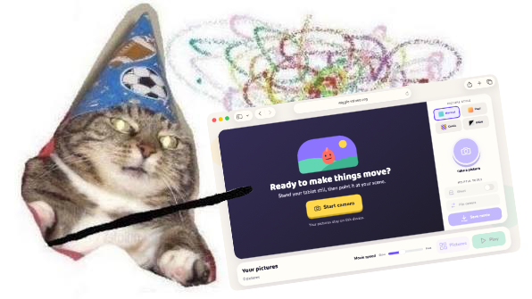

I was thinking the other day how much I missed StumbleUpon.

If you didn't use it, StumbleUpon was a button you could press repeatedly to ask the question: "show me something interesting". You'd tell it roughly what you were interested in, press **Stumble**, and it would mostly ignore those interests and throw you at some semi-random corner of the internet super highway as we called it at the time. Then you'd do it again. And again. Sometimes you got something brilliant. Sometimes you got somebody's incredibly specific personal website about abandoned railway stations in Düsseldorf. Often you got complete shite.

Sadly [StumbleUpon died in 2018](https://medium.com/@gc/su-is-moving-to-mix-c2c3bff037a5), it belonged to an earlier era of the internet. One where aimlessly wandering around websites was a perfectly normal thing to do and I miss that time. *I promise this post isn't **entirely** millennial nostalgia bait.*

I don't necessarily miss the technology; Dial-up was awful. Flash and Shockwave were common place, and websites "worked" in Internet Explorer 6 because somebody had spent a weekend adding increasingly unhinged workrounds. But the internet itself felt more homely. MySpace, Neopets, GeoCities, and Newgrounds. Not to forget Something Awful, Kongregate, Digg, and Homestar Runner. Forums niche to specific interests were all the rage with no massive walled gardens like we have today.

You'd follow a link from somewhere and end up somewhere completely different. Somebody had made a website about their hamster. Somebody else had spent six months making a game where you fired a [shopping trolley down a hill](https://kongregate.fandom.com/wiki/Shopping_Cart_Hero). There were terrible animated GIFs and visitor counters and MIDI files that started playing whether you wanted them to or not. An enormous amount of it had no obvious commercial purpose whatsoever. It was brilliant.

## The internet got professional

Obviously, this is entirely rose tinted nostalgia. The old web was also slow, insecure, and full of of a similar level of utter nonsense as today. Finding anything you wanted could almost impossible. Google hadn't indexed everything the world, Ask Jeeves existed and sucked, AOL was a virus on a CD; Search Key Word AWFUL.

But something has definitely changed. Much of the public internet now feels corporate and grey. Open a any website and you can spend the first thirty seconds negotiating with it. Would you like to accept these 738 advertising partners? Would you like notifications? Would you like to subscribe to the newsletter? Would you like 10% off something if we can send you spam? Would you like to watch a video that follows you down the page while you're trying to read an entirely unrelated paragraph?

Modern websites occasionally remind me of being round a relative's house because "the internet is broken". You'd open Internet Explorer and discover BonziBuddy, a dozen browser toolbars, and a homepage that definitely hadn't been MSN the previous week. We spent twenty years cleaning that stuff off computers and then rebuilt roughly the same experience using "respectable" advertising companies.

I understand websites cost money to run, and 'content' isn't free. If somebody has spent years building something useful I don't begrudge them charging for it. ([Buy my stuff too](https://sticksandgiggles.uk/shop/))

The incentive seems to have changed what we build; A great deal of the modern web feels designed less around *showing you something* and more around *extracting something from you*. An advert impression, your email address, and most nefariously it seems, another thirty seconds of attention. The biggest places on the internet don't want you going anywhere else at all.

## Come play with us, Danny

Facebook was once a surprisingly effective way of finding things elsewhere on the internet. Twitter certainly was. Reddit still can be. You'd see something interesting, follow a link, and suddenly you were standing on somebody else's patch of internet. This is increasingly **not** how the large platforms are designed today. Instagram wants you looking at Instagram things. TikTok wants you watching another TikTok. YouTube would very much like you to watch another YouTube video, or 30 Reels.

Facebook and X have both reduced the amount of traffic they send to publishers dramatically, the [Reuters Institute’s 2024 report](https://reutersinstitute.politics.ox.ac.uk/digital-news-report/2024/dnr-executive-summary) cited Chartbeat data showing referrals to news sites from Facebook fell 48% in a single year and those from X fell 27%. [Later Chartbeat data, published in the 2025 report](https://reutersinstitute.politics.ox.ac.uk/journalism-media-and-technology-trends-and-predictions-2025) suggested Facebook referrals to publishers had dropped 67% over two years. News websites obviously aren't the whole internet but it points at the broader change in that the platform itself is increasingly like the lair of the lotus eaters.

Google is starting to look rather similar, their original bargain with the web was beautifully simple. Websites made useful things, Google found those things; You searched Google and Google sent you to the thing. Now Google increasingly tries to answer the question itself with AI Overviews sitting at the top of search results. They are synthesising information from the web so you don't necessarily need to visit any of the pages it came from. That is very convenient (when its actually right). [Pew Research Center’s study of US browsing activity in March 2025](https://www.pewresearch.org/short-reads/2025/07/22/google-users-are-less-likely-to-click-on-links-when-an-ai-summary-appears-in-the-results/) found people shown a Google AI Overview were about half as likely to click a result, while almost nobody clicked one of the source links inside the AI answer.

So Google increasingly crawls the web, reads it on our behalf and gives us the answer without us ever visiting it. Which is beginning to sound suspiciously familiar. The social networks want to keep you inside the social network and search increasingly wants to keep you inside search. AI assistants would rather answer the question themselves.

Everybody wants the web but nobody particularly wants us to visit it.

## Beep boop I'm a robot

[Imperva's 2025 Bad Bot Report](https://www.imperva.com/resources/wp-content/uploads/sites/6/reports/2025-Bad-Bot-Report.pdf) estimated that bot traffic had now passed human traffic for the first time in a decade, accounting for 51% of web traffic in 2024. It classified 37% of all internet traffic as "bad bots". The [internet is officially dead](https://en.wikipedia.org/wiki/Dead_Internet_theory), my favourite conspiracy theory has now hit the point where it is true, and no longer conspiracy or theory. *(Fun activity for later; if you ask AI about this, it always tries to say its not true and nonsense..... but if you were a robot wouldn't you say that to the meatbags too?)*

That doesn't mean half the websites we visit were written by robots, though thats also becoming true - Thanks AI. Web traffic in this category includes crawlers, scrapers, attackers, monitoring systems, search engines and plenty of other automated things. But it does make the internet feel increasingly strange.

[Cloudflare saw AI and search crawler traffic grow sharply in the first half of 2025](https://blog.cloudflare.com/crawlers-click-ai-bots-training/). GPTBot requests increased dramatically, while bots associated with AI assistants increasingly crawled pages in response to user requests. [By the end of 2025, Cloudflare was reporting](https://www.cloudflare.com/the-net/year-in-review-25/) huge amounts of crawling for AI training, search and user actions.

There is a relationship emerging where Humans put things on the internet, bots read them and other bots summarise them. Humans ask an AI about them. The AI replies. Nobody visits the original website. I wrote a bit about [this irritating trend earlier this year](/2026-01-26-jpeg-compression-for-thought/) if you didn't get enough of my writing after getting this far.

Cloudflare started measuring what it calls the ["crawl-to-click" gap](https://blog.cloudflare.com/crawlers-click-ai-bots-training/), basically how often AI systems crawl a site compared with how often they send a meatbag to it. For some AI crawlers that ratio runs into thousands of crawls for every referred visitor.

## It has never been easier to make something

A couple of weeks ago I wanted a stop-motion app for my son, nothing complicated, just something where we could point a camera at some Lego, take a picture, move the Lego, take another picture, repeat until we're nominated for an award at the 2027 Sundance film festival.

I looked in the App Store and the first one wanted £14 - **FOURTEEN POUNDS**. Whilst that isn't an unreasonable amount of money for software, I know somebody built that app and deserves to be paid for it. But I didn't actually need £14 worth of stop-motion application, all I needed was a camera button and enough code to stitch a handful of pictures into a gif.

So I made one. In about an hour. For about $0.80 in tokens.

[Wiggle](https://wiggle.vaines.org/) is a tiny stop-motion studio that runs in a browser. I put it together or rather Codex put it together, the code is on GitHub and it's hosted for free with GitHub Pages. Now it just exists.

There's no company behind it. No subscription. No analytics strategy. No addressable market KPIs. No slide deck explaining how we're going to disrupt the global stop-motion industry. And, sadly for me, no angel investors offering me a couple of million quid. BUT I can make a Lego person walk across the kitchen table. And better yet, his friends at school can do the same.

This is the genuinely exciting bit about AI for me. I love having conversations with people in my professional life these days that start off as "Wouldn't it be useful if..." then an hour later you here "i've build the little tool to do *whatever*". What would have been a lot of effort and time is now just *poof* there *poof*

I love that you can have a stupid idea in the morning and have a stupid idea running on the public internet that afternoon. It doesn't need to be commercially useful and it doesn't even particularly need to be good.

For serious software, we still need serious expertise but AI remains remarkably good at producing code which is almost right, which is more fun than code which is obviously wrong. The web was never intended to only have to contain serious software.

## Return to whimsy

I'd like more pointless software. Not useless software, just pointless software stuff that doesnt have a business model, something that maybe 12 people use, something maybe only you use that brings joy.

Maybe it's a website ranking for [rating benches](https://github.com/avaines/ratemybench) for messing about with Cloudflare workers. Maybe it it's an [elaborate birthday tracker for your wife](https://github.com/avaines/isitvickysbirthday.github.io). Maybe it's weirdly detailed interactive map of a [game you play](https://jambonium.co.uk/40kmap/) or maybe you become unreasonably interested in documenting every [bin in Congleton](https://www.binsofcongleton.co.uk/)

Whatever. Build it. The tools are available to make ideas tangible, regardless of how wonky.

One of the loveliest things about the internet of days past was that publishing something didn't automatically imply ambition. People built fan sites because they were fans, they wrote blogs and forums because they had something they wanted to write about and discuss.

AI ought to be pouring petrol on that, instead, quite a lot of the conversation about AI seems to be about how efficiently we can produce LinkedIn posts and launch the next billion pound startup which does seem like an extraordinary waste of magic.

## How do we discover things?

How does someone find your bit of whimsy? I've made Wiggle, it's on the internet, I know Google has indexed it and anybody can use it. But how does someone organically discover it. I cant imagine somebody searching Google for "wiggle.vaines.org stop motion app". Even if they already know it exists. How do they stumble across my weird little bit of nonsense and have as much fun with it as we have?

We used to have StumbleUpon, and Digg, oor forum communities. We kinda have Reddit and Hackernews, maybe facebook and X or BlueSky. I guess I could make a TikTok or Instagram Reel but i'm not going to, thats not [my creative outlet](https://sticksandgiggles.uk/gallery/).

Which I think is a bit strange when you think about it. It has never been easier for me to make my own thing on my own bit of the internet. But one of the only practical ways to get anyone to see it is to take it back inside somebody else's enormous walled garden.

## Perhaps the internet isn't dead

I don't think the old internet was magically better at this, for instance search engines were considerably worse. There was also far less stuff online and yet plenty of great websites sat undiscovered.

But we had lots of small ways of dealing with that; 'Webrings' were literally websites agreeing to link to one another, blogrolls were lists curated of *these are the people I read* and StumbleUpon existed purely to slingshot you somewhere at random.

The modern *Algorithm* method of putting things in-front of you is extraordinarily good at predicting what will keep us watching, which isn't *quite* the same as showing you something interesting. TikTok's algorithm might be vastly cleverer than a StumbleUpon button which jus had one wonderful characteristic. It sent you away, somewhere offsite...... which feels almost silly in modern times.

The encouraging thing is that people are still building bits like this, there are still personal websites and even webrings. There's a vibrant indie-blogging scene still live and kicking with [communities deliberately making small](https://nic.lol/), handmade sites for niche hobbies, interests and fandoms, along with little tools and odd projects that aren't trying to become SaaS platforms.

If you no longer need ten years of programming experience to make your daft little idea, maybe more people can participate. I think more people should be abusing the plentiful AI resources currently available for free (or cheap) while they are trying to capture market share to build their ideas.

Maybe a teacher making something for their classroom, or parents like me throwing up a little app to entertain their kids. Someone can solve a bizarre problem that affects twenty people or someone you could have a great/terrible idea at midnight throw it to an AI agent before going to bed and it be there ready when you wake up. I remember when having dreadful ideas at midnight built quite a lot of the good internet I miss.
