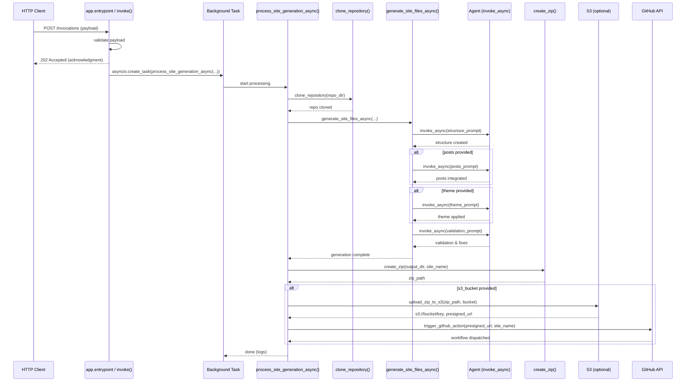

**Static Site Generators are good, but what if they were more gooder?**

During December I usually spend time doing [Advent of Code](https://adventofcode.com/). With it only being 12 days this year, I’ve been left with some spare capacity and a reminder of how much I enjoy Python. I’ve been looking for an excuse to play with AWS Bedrock AgentCore, and the [StrandsAgents](https://strandsagents.com/) framework works great in Python.

My website is built with [Hugo](https://gohugo.io/), a static site generator. I love an SSG. Whether it’s for documentation or a quick one-shot idea, they’re excellent for fire-and-forget websites with almost zero upkeep. They can also be hosted in a few places for free.

The build phase itself is fairly easy. The worst part is building themes and styling things before I can get down to writing content. But what if I could just skip that bit entirely? After all, we have AI now, and writing code is for robots and nerds.

Given my last post about [Prompt Driven Development](/posts/2025-11-08-prompt-driven-development/), this idea felt related. AI is supposed to do the chores and free us up to focus on creative work like art, music, and writing. The last few years, however, seem to show the opposite happening. AI is doing the art, music, and writing, while we’re left doing the dishes and the vacuuming.

The plan was to let humans focus on the creative part, namely the content, and get an AI to dynamically build a website around it. In theory, it could theme the site based on the latest post or the time of year, great given I'm writing this over the Christmas break.

That's the starting point. A place where I write the content, robots do all the nerd stuff, and out pops a lovely website.

**Choose Bedrock. Choose AI. Choose Autonomy**

I’ve seen a lot of features and marketing positioning AWS Bedrock AgentCore as the new hotness, and I’d wanted an excuse to look at it for a while. The pitch is to use StrandsAgents, a library and suite of tooling for rapidly developing and orchestrating multi-agent systems. In practice, I took that to mean removing all the legwork I’d previously experienced building standard Bedrock Agents.

I started building somewhat naively, based on what I’d done before. That usually meant writing helper functions as “tools” and relying on the model to select and sequence them based on a set of instructions. If you structure the agent’s core prompt and tool descriptions carefully enough, this works reasonably well.

AgentCore and StrandsAgents take a different approach. You package everything into a container and run that inside the service. It supports `@tool` decorators for functions, so you can write handlers in a similar way to traditional Bedrock Agents. For this exploration, though, I ultimately abandoned letting the model determine its own workflow, including which tools to use and when.

The extra autonomy wasn’t something I needed. The agent is performing a single, well-defined, sequential task. Allowing it to decide what to do next only increased the number of failure modes without adding anything useful.

If the agent isn’t autonomous, then what is it actually doing?

The setup is fairly simple. A GitHub Actions job invokes the Bedrock AgentCore runtime, which runs the agent and then triggers the deploy workflow once it finishes. Compared to a traditional Bedrock Agent there is substantially fewer moving parts while achieving similar goals.

The agent starts by cloning the [repo](https://github.com/avaines/ai-site-generator-blog) where the blog posts are then we run the AI portion of the site generation process across four logical steps (If you try do it in a single shot you'll run out of tokens).

1.  *Build a simple 11ty project structure*
2.  *Import the posts from the repo*
3.  *Import the theme/layout overloads from the repo*
4.  *Validate and review the artefact and make sure it works* <- which it gets right most of the time.

Once complete, the output is zipped, uploaded to S3, a pre-signed URL is generated, and the Github actions *deploy* workflow gets triggered.

I originally tried to do all this in a single prompt, when it didn't run out of tokens the model happily wrote files correctly. It seems to figure out what files need to exist, then for each file it figures out what it should contain. It doesn't build them incrementally which results in frequently broken sites through inconsistently applied variables and subtle errors that only surface at build and runtime. By forcing those explicit states and, critically, ending with a validation and repair step, the failure rate dropped significantly, though it never fully disappeared.

As a sequence diagram its a bit easier to follow the workflow, you can also see why having the agent autonomously selecting tools as it likes didn't really make sense.

For completeness, the [repository](https://github.com/avaines/ai-site-generator-blog) includes the AgentCore container code and Terraform to deploy it. The end result is that a repository intended to contain nothing but content also also happens to contain 550 lines of HCL and Python, which feels slightly at odds with the original goal.

**It works! ......depending on your definition of 'working'**

From a cost perspective, I had some AWS credits to burn, but even then it’s hard to justify. Using the Amazon Nova models produced consistently broken and incomplete site artefacts. To get anything usable I had to switch to Anthropic’s Claude model. StrandsAgents conveniently defaults to Claude 4 Sonnet at the moment, but those Anthropic models come via the AWS Marketplace rather than being native Bedrock models. I hadn’t clocked that they weren’t covered by my credits. A handful of runs later and I’d spent about $35 to generate a static website.

That’s probably fine if you frame it as designing a site from scratch every time. It’s indefensible if you think of it as a build step.

Performance tells a similar story. A normal `npm run build` for a site like this takes a few seconds. The agent-based pipeline takes somewhere between fifteen and twenty minutes to run. It *is* doing work that would take me several hours if I were manually designing and styling a site, but that comparison only really works once. After that, what you want from a build is speed and predictability. The novelty of wondering what the site will look like next time you visit it, or whether it’s even working, is briefly amusing, but it wears thin quickly.

Reliability is where things really fall apart. The system produces a fully functional site roughly seventy to eighty percent of the time. When it works, it can be genuinely amusing. One build introduced cursor animations that sparkled as you moved around the page. Publishing a new post and seeing the site come out completely different has a certain charm. When it doesn’t work, you’re left debugging the output of a system that has already abstracted away most of the context you would normally rely on, leaving you with one realistic option: rerun the build and hope for the best.

Determinism turns out not to be an implementation detail, but a feature. Even with the ability to override themes and styles, the results are inconsistent in ways that are difficult to reason about. Handing responsibility to a closed AI system always introduces risk, and sometimes that trade-off is acceptable. For the one place your content is meant to live, it feels like a step too far.

- 
- 
- 
- 
- 
- 
- 
- 

None of this is really an indictment of StrandsAgents or AgentCore themselves. Strands was genuinely fun to work with. Being able to develop, build, and test the agent locally before deploying it into the Bedrock AgentCore service is dramatically simpler than wiring up a traditional Bedrock Agent with multiple Lambda handlers, IAM roles, and all the associated deployment artefacts.

The idea was a bit silly from the outset. Replacing a static site generator with a non-deterministic, twenty-minute, money-burning build step was never going to be sensible. But it was fun, and I learned a lot. There are clearly useful workflows where dynamically generating code on the fly makes sense, particularly where variability is a feature rather than a liability. This just isn’t one of them.

I’m not planning on switching this site over to this process any time soon and thanks to [Siddharth](https://www.linkedin.com/in/siddharth-nair-161b65a8/) for tinkering on this with me.
